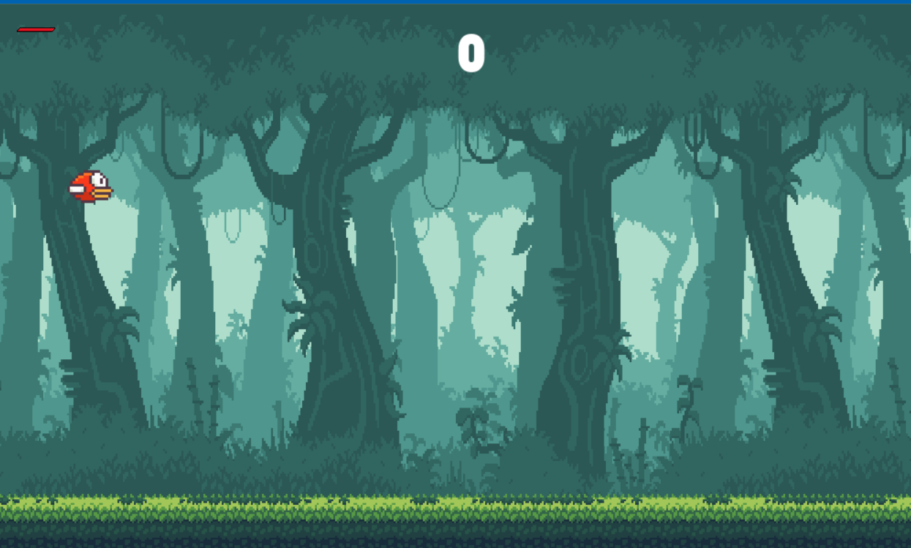
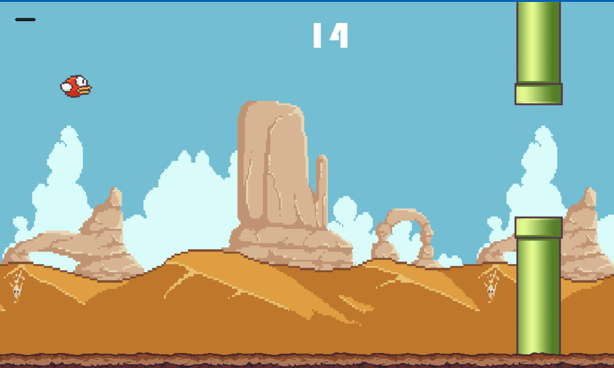
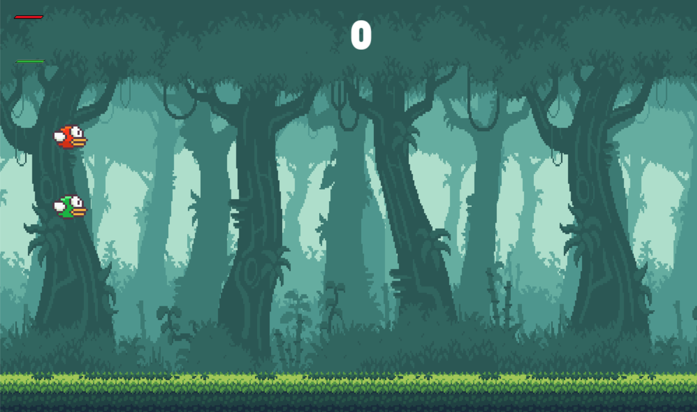

🕊️ Wing Jump

A Flappy Bird–inspired game built with Pygame, featuring single-player and two-player modes, health systems, dynamic backgrounds, and increasing difficulty.

🎮 Features

Single Player & Two Player Modes

Health Bar System (4 HP per player)

Dynamic Difficulty (speed, gap size, spawn rate)

Scrolling Background & Ground (changes every 10 points)

Sound Effects (flying, collision, death)

Controller & Keyboard Support

Main Menu & Restart System
| Player   | Keyboard  | Controller   |
| -------- | --------- | ------------ |
| Player 1 | `SPACE`   | X / Square   |
| Player 2 | `Arrow ↑` | O / Triangle |
📂 Project Structure
WingJump/
│── parallax/                 # Game assets (images, sounds, icons)
│── maint(t).py # Main game file
│── README.md                  # Project documentation

## 📸 Screenshots  

### Main Menu  

### Gameplay  

### Gameplay with two players  

### A Gameplay Video

https://github.com/user-attachments/assets/7936e48d-6afc-45ba-8aa8-423cccf1c7b2

🏆 Credits

Developed by Abdullah
Inspired by Flappy Bird, reimagined with multiplayer, health, and advanced features.
